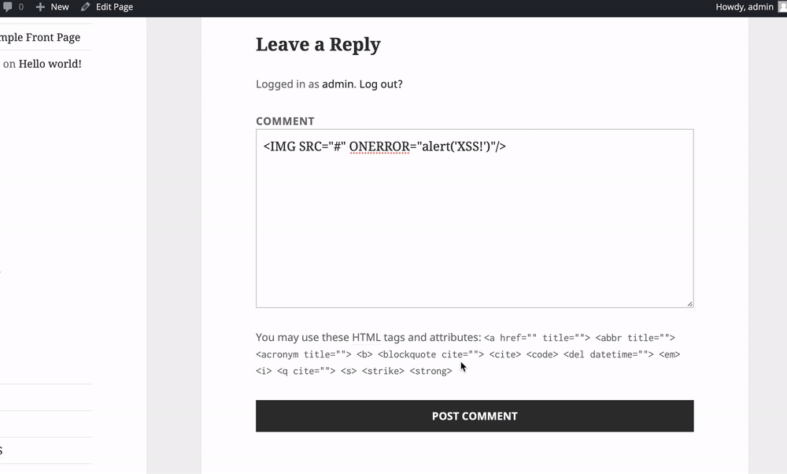
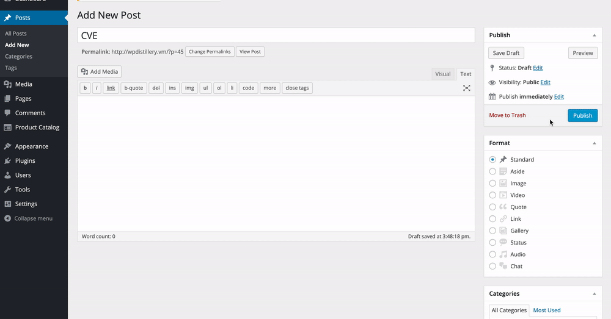

# Project 7 - WordPress Pentesting

Time spent: **X** hours spent in total

> Objective: Find, analyze, recreate, and document **five vulnerabilities** affecting an old version of WordPress

## Pentesting Report

### 1. (Required) Vulnerability Name or ID: CVE 2019-9787
  - [X] Summary: Client side XSS vulnerability in comment field of page
    - Vulnerability types: Execute Code Cross Site Scripting CSRF
    - Tested in version: 4.2
    - Fixed in version: 5.1.1
  - [X] GIF Walkthrough: 
  - [X] Steps to recreate: 
    1) Create a page. 
    2) 2) Go to created page and leave "<IMGSRC="#"ONERROR="alert('XSS')"/>" as a comment to exploit the vulnerability. 
    3) Refresh page and javascript will be run. 
  - [X] Affected source code:
    - [Link 1](https://github.com/WordPress/WordPress/blob/master/wp-admin/includes/ajax-actions.php)
### 2. (Required) Vulnerability Name or ID CVE 2016-7168
  - [X] Summary:Cross-site scripting (XSS) vulnerability in the media_handle_upload function in wp-admin/includes/media.php in WordPress before 4.6.1 might allow remote attackers to inject arbitrary web script or HTML by tricking an administrator into uploading an image file that has a crafted filename.  
    - Vulnerability types: Cross Site Scripting
    - Tested in version: 4.2
    - Fixed in version: 4.6.1
  - [X] GIF Walkthrough:  
  - [X] Steps to recreate: 
    1)Send a file with a malicous name to admin/victim
    2) Get admin to create a post using the maliciously named photo (attatchemnt page)
    3) Once uploaded and viewed within WordPress the script code is executed
  - [X] Affected source code:
    - [Link 1](https://github.com/WordPress/WordPress/commit/c9e60dab176635d4bfaaf431c0ea891e4726d6e0)
### 3. (Required) Vulnerability Name or ID User Enumeration
  - [X] Summary: Using WPScan, all users associated with the WordPress page are made available to the attacker
    - Vulnerability types: Enumeration
    - Tested in version: 4.2
    - Fixed in version: N/A
  - [X] GIF Walkthrough: 
  - [X] Steps to recreate: 
    1)Download WPScan 
    2)Enter the following command into the terminal: wpscan --url [target IP or URL] --enumerate u
    3)Analyze output for users associated with the provided URL/IP
  - [X] Affected source code:N/A
    - [Link 1](N/A) 

## Assets

List any additional assets, such as scripts or files

## Resources

- [WordPress Source Browser](https://core.trac.wordpress.org/browser/)
- [WordPress Developer Reference](https://developer.wordpress.org/reference/)

GIFs created with [LiceCap](http://www.cockos.com/licecap/).

## Notes

Describe any challenges encountered while doing the work

## License

    Copyright [yyyy] [name of copyright owner]

    Licensed under the Apache License, Version 2.0 (the "License");
    you may not use this file except in compliance with the License.
    You may obtain a copy of the License at

        http://www.apache.org/licenses/LICENSE-2.0

    Unless required by applicable law or agreed to in writing, software
    distributed under the License is distributed on an "AS IS" BASIS,
    WITHOUT WARRANTIES OR CONDITIONS OF ANY KIND, either express or implied.
    See the License for the specific language governing permissions and
    limitations under the License.
