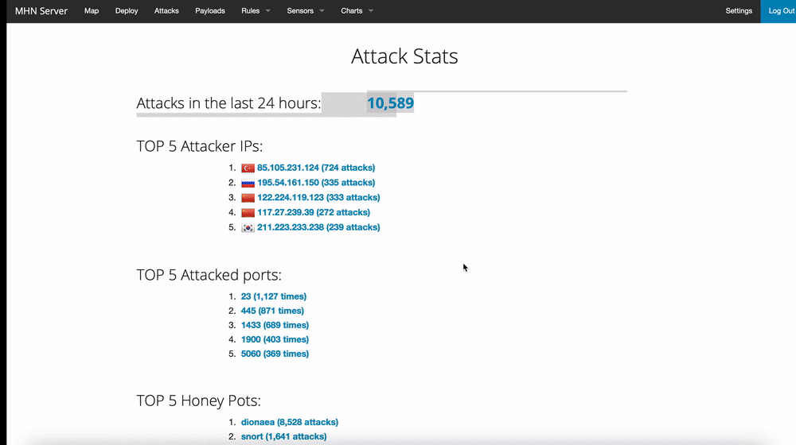
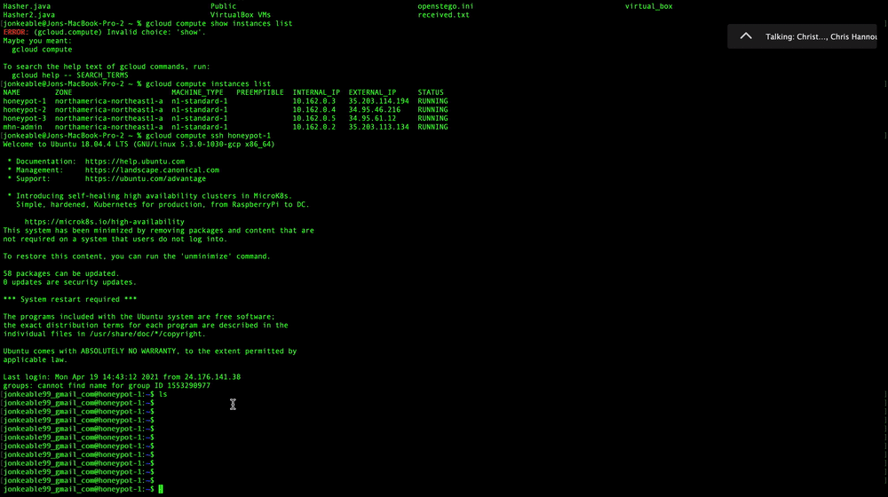
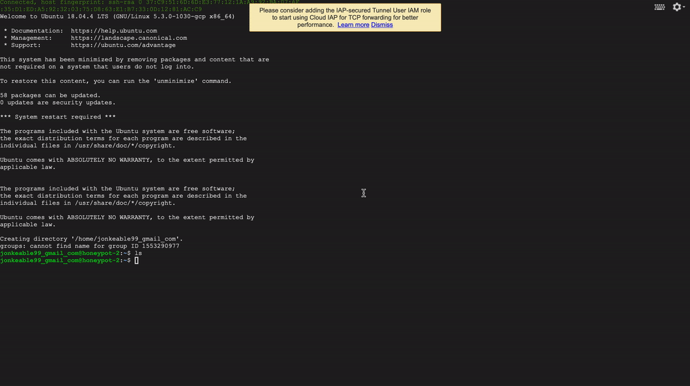

# Honeypot Assignment

**Time spent:** **7** hours spent in total

**Objective:** Create a honeynet using MHN-Admin. Present your findings as if you were requested to give a brief report of the current state of Internet security. Assume that your audience is a current employer who is questioning why the company should allocate anymore resources to the IT security team.

### MHN-Admin Deployment (Required)

**Summary:** Deployed MHN-Admin with Google's gcloud platform. MHN-admin acts an admin VM that is used to deploy/manage many different honeypots that serve many different purposes from one location. 

### Dionaea Honeypot Deployment (Required)

**Summary:** Dionaea is a honeypot that has the goal of trapping malware that is exploiting vulnerabilties exposed by services offered to a network (i.e. file transfer VoIP. e-mail, etc). 

### Database Backup (Required) 

**Summary:** MHN-Admin uses SQLite as the relational database management system. Additionally, the exported JSON file record contains logs of attacks launched at the honepots, including date, src and dst port, protocol, honeypot name, and md5/sha-512 hashes of malware. 

*Be sure to upload session.json directly to this GitHub repo/branch in order to get full credit.*

### Deploying Additional Honeypot(s) (Optional)

#### X Honeypot

**Summary:** What does this honeypot simulate and do for a security researcher? Conpot simulates the behavior of a system under constant load to trick the attacker into thinking they have discovered a complex industrial control system. It allows a security researcher to gain insight into how advisaries carry out attacks on important infrasutrctre and who they are (geographically). 

### Malware Capture and Identification (Optional)

#### X Malware

**Summary:** How did you find it? Which honeypot captured it? What does each malware do?

MD5 Hash: *Run `md5sum` on the file and record the hash here.*

SHA1 Hash: *Run `sha1sum` on the file and record the hash here.*

### Notes

Had issues with gcloud SSH. Resolved after troubleshooting and removing old SSH keys and running "gcloud compute SSH mhn-admin" again. 
