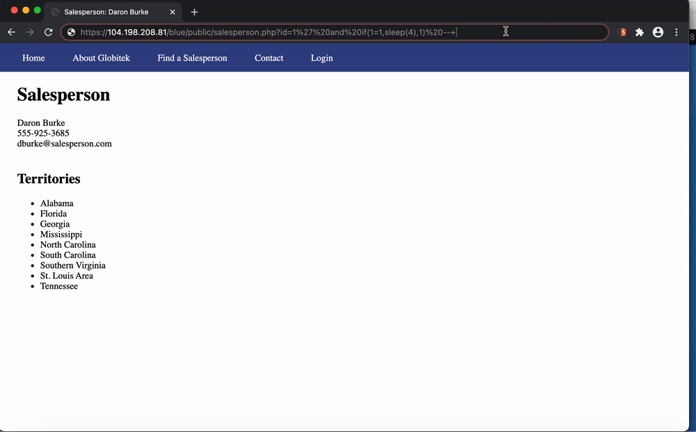
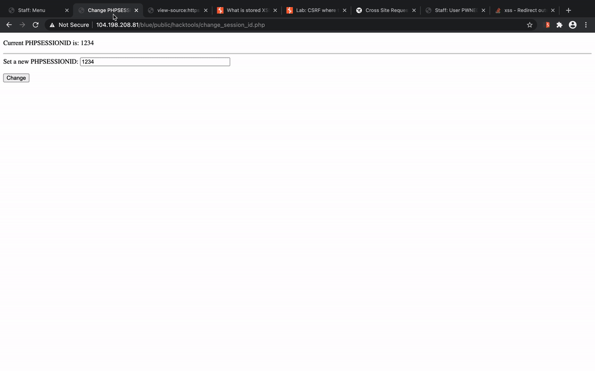
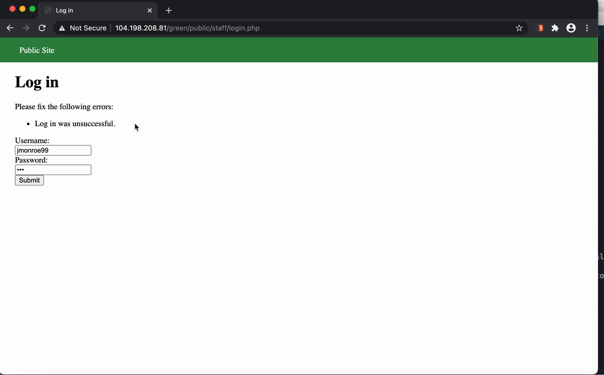
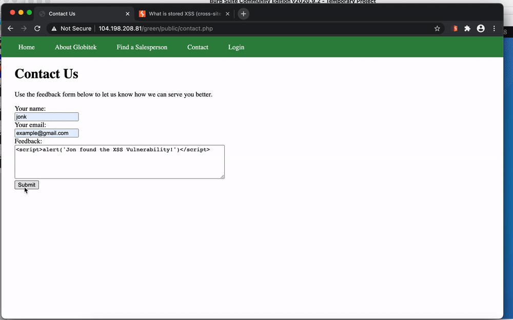
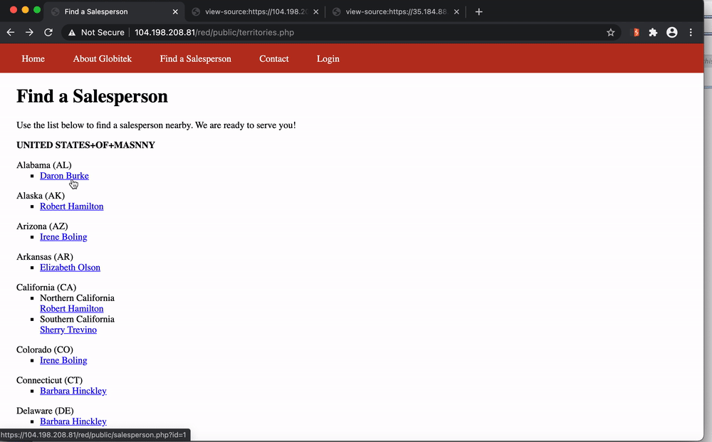
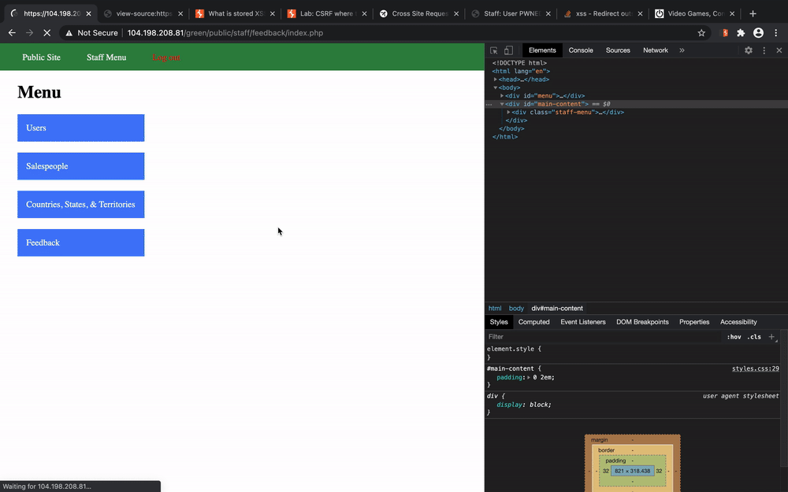

# Project 8 - Pentesting Live Targets

Time spent: **8** hours spent in total

> Objective: Identify vulnerabilities in three different versions of the Globitek website: blue, green, and red.

The six possible exploits are:

* Username Enumeration
* Insecure Direct Object Reference (IDOR)
* SQL Injection (SQLi)
* Cross-Site Scripting (XSS)
* Cross-Site Request Forgery (CSRF)
* Session Hijacking/Fixation

Each color is vulnerable to only 2 of the 6 possible exploits. First discover which color has the specific vulnerability, then write a short description of how to exploit it, and finally demonstrate it using screenshots compiled into a GIF.

## Blue

Vulnerability #1: SQLi

Description: The salesperson.php page is vulnerable to a time-based blind SQLi attack. Using the query: "id=1' and if(1=1,sleep(4),1)%20--+", the MySQL db sleeps for 4 seconds before processing the GET request. 1=1 is a tautology and thus evaluates to True, the execution of the sleep timer indicates that the result of the query is true. An attacker can use this vulnerability to gain information on the db depending on whether or not the db returns with a delay.

Vulnerability #2: Session Hijacking

Description: use the provided "public/hacktools/change_session_id.php" script to set the phpsession to any value once the victim is logged in. From another browser, open the same php script and set the session id to that of the victim. Refresh the page and access the login menu, the session now matches that of the victim and authentication is confirmed allowing the attacker access to the admin page and can manipulate data as desired.

## Green

Vulnerability #1: User Enumeration

Description: An attacker is able to gain information about which users are valid in the database via the response provided. If a specific username is valid but the password is incorrect, the error response from the server will be in bold due to the inherited formatting of span.failed. However, if the username is not valid, the error response from the server will not be in bold. 

Vulnerability #2: Stored XSS

Description: The green site is vulnerabile to a stored XSS attack. The web app doesn't seem to use proper validation or escaping, thus allowing the attacker to inject javascript and causing the browser to execute the code as it is interpreting the page where the script is stored. 

## Red

Vulnerability #1: IDOR

Description: the IDs of the salepeople are able to be enumerated through on the public site once the pattern of is recognized. ID 10 should not be served to the user

Vulnerability #2: CSRF

Description: Create a file with html code pointing to the "edit user" form in the admin section. The written code will modify the value of the chosen parameter once the unsuspecting admin vists the webpage. The victim is tricked into carrying out an unintentional action

## Bonus

Bonus Objective 2a:

## Notes

Describe any challenges encountered while doing the work
